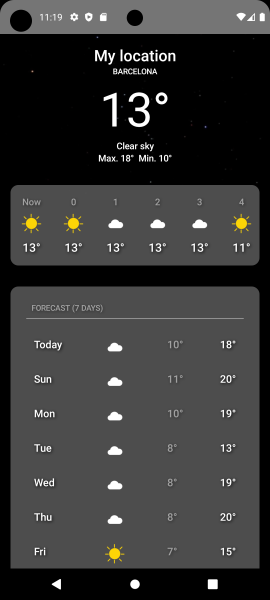
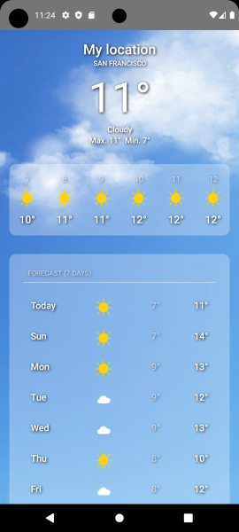

# Android Weather App
## Overview
WeatherApp is a simple Android application designed to provide real-time weather information through OpenMeteoAPI. 
Utilizing the latest Android development technologies and Jetpack Compose for UI, this app offers an elegant and intuitive user experience. 
It is primarily educational, aimed at showcasing best practices in Android development, including MVVM and Clean Architecture.

 


## Architecture
WeatherApp adheres to the Model-View-ViewModel (MVVM) architecture, cleanly separating the UI (View) from the data (Model) and business logic (ViewModel). 
It also follows the Clean Architecture principles, dividing the codebase into three distinct layers: Data, Domain, and UI, for enhanced maintainability and scalability.

## Features

### Weather Information

- Current Weather: Displays the current weather details, including temperature, conditions, and location-based data.
- Hourly Forecast: Offers an hourly weather forecast, allowing users to plan their day with precision.
- Daily Forecast: Shows a 7-day weather outlook with key information such as high/low temperatures and general conditions.

### User Experience

- Dynamic Background: The background image dynamically changes based on the current weather conditions and day/night, enhancing the user's visual experience.
- Location-Based Results: Automatically fetches and displays weather data based on the user's current location.

### Libraries Used
- Jetpack Compose: For building modern, declarative UIs.
- Hilt (Dagger): For dependency injection, ensuring a modular and testable codebase.
- Kotlin Coroutines: For managing asynchronous tasks and handling background processing.
- Retrofit: To handle network requests to the weather API.
- ViewModel: To manage UI-related data in a lifecycle-conscious way.
- Material Design: Implements Material Design guidelines for a polished and cohesive look and feel.

## Possible Enhancements
- Weather Alerts: Integration of severe weather alerts and notifications.
- Customizable Locations: Ability to save and view weather for multiple locations.
- Settings: User preferences for units (Celsius/Fahrenheit), themes, etc.
- Weather Maps: Interactive maps showing weather patterns and radar data.
- More Data: Display more detailed data about weather.

## License
```xml
MIT License

Copyright (c) 2024 Carlos Yáñez

Permission is hereby granted, free of charge, to any person obtaining a copy
of this software and associated documentation files (the "Software"), to deal
in the Software without restriction, including without limitation the rights
to use, copy, modify, merge, publish, distribute, sublicense, and/or sell
copies of the Software, and to permit persons to whom the Software is
furnished to do so, subject to the following conditions:

The above copyright notice and this permission notice shall be included in all
copies or substantial portions of the Software.

THE SOFTWARE IS PROVIDED "AS IS", WITHOUT WARRANTY OF ANY KIND, EXPRESS OR
IMPLIED, INCLUDING BUT NOT LIMITED TO THE WARRANTIES OF MERCHANTABILITY,
FITNESS FOR A PARTICULAR PURPOSE AND NONINFRINGEMENT. IN NO EVENT SHALL THE
AUTHORS OR COPYRIGHT HOLDERS BE LIABLE FOR ANY CLAIM, DAMAGES OR OTHER
LIABILITY, WHETHER IN AN ACTION OF CONTRACT, TORT OR OTHERWISE, ARISING FROM,
OUT OF OR IN CONNECTION WITH THE SOFTWARE OR THE USE OR OTHER DEALINGS IN THE
SOFTWARE.
```
